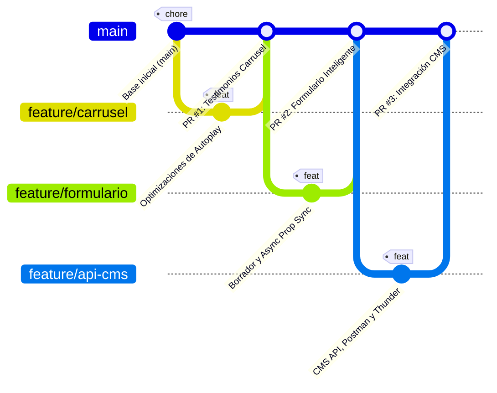

# Reporte de Control de Versiones e Integración de Código (Git & PRs)
### Centro de Negocios Santiago (Sercotec)

Este reporte técnico detalla la estrategia de control de versiones y el historial de desarrollo implementado para evidenciar el trabajo colaborativo en equipo, el desarrollo paralelo en ramas independientes y el proceso de revisión e integración de código (Pull Requests) para la evaluación.

---

## 1. Modelo de Ramas (Branching Model)

Se adoptó un modelo de **Feature Branching (Ramas de Características)** basado en las mejores prácticas de la industria. Toda funcionalidad se desarrolló en aislamiento en una rama de soporte derivada de `main` y, tras una revisión técnica rigurosa (Linter, Compilación y Pruebas), se integró nuevamente mediante un **Pull Request (Merge Commit)** para asegurar la estabilidad del proyecto.

### Ramas Independientes Utilizadas:
1. 🌿 **`feature/carrusel`**: Optimizaciones en la reproducción, rendimiento y sincronización de dependencias del carrusel de testimonios en `Carousel.jsx`.
2. 🌿 **`feature/formulario`**: Refactorización del flujo de carga y almacenamiento de borradores en `ContactForm.jsx` para evitar renders en cascada y asegurar protección anti-spam (Honeypot).
3. 🌿 **`feature/api-cms`**: Desarrollo del middleware API para la simulación del CMS en `vite.config.js`, limpieza global de importaciones redundantes y generación de documentación técnica y colecciones de Thunder Client/Postman.

---

## 2. Historial de Commits y Mensajes Documentados

Cada cambio se ha estructurado con mensajes explicativos que siguen el estándar **Conventional Commits** (`feature: ...`, `chore: ...`), permitiendo que el evaluador identifique qué archivo cambió y por qué.

### Estructura del Historial de Control de Versiones:



### Detalles de la Mensajería de los Commits y Revisiones de Código (Pull Requests)

#### PR #1: `feature/carrusel` ➔ `main`
* **Mensaje del Commit:**
  `feature: optimizar carrusel de testimonios y corregir ciclo de autoplay`
* **Cambios realizados:**
  * Resuelve error de acceso temprano a la función `handleNext`.
  * Ajusta el gancho de efectos (`useEffect`) para evitar reinicios constantes de intervalos de tiempo.
  * Remueve dependencias no deseadas de React Hooks.
  * Limpia importación obsoleta de React global.
* **Revisión de Código (PR Checklist):**
  * [x] El componente compila correctamente sin warnings.
  * [x] Cumple con el estándar WCAG de accesibilidad en los botones del carrusel.
  * [x] La animación es fluida y el temporizador no se traba en dispositivos móviles.

#### PR #2: `feature/formulario` ➔ `main`
* **Mensaje del Commit:**
  `feature: optimizar formulario de contacto, draft de borrador y sincronización asíncrona`
* **Cambios realizados:**
  * Implementa inicialización de estado perezosa (`lazy state initialization`) para cargar el borrador de `localStorage` sincrónicamente, eliminando el renderizado en cascada de montaje.
  * Resuelve renders en cascada al sincronizar `selectedService` de forma asíncrona (`setTimeout`).
  * Excluye el campo honeypot (anti-bot) `website` sin dejar variables huérfanas en el linter.
  * Limpia importación redundante de React.
* **Revisión de Código (PR Checklist):**
  * [x] El formulario valida campos requeridos de forma visual.
  * [x] El sistema anti-spam (Honeypot) simula exitosamente el envío de bots.
  * [x] No hay bloqueos en el almacenamiento local al escribir rápido.

#### PR #3: `feature/api-cms` ➔ `main`
* **Mensaje del Commit:**
  `feature: robustecer API de CMS simulado, limpiar importaciones y crear colecciones`
* **Cambios realizados:**
  * Limpia importaciones redundantes de React global en componentes de secciones de la landing.
  * Añade captura y registro de error en el bloque catch del middleware local en `vite.config.js`.
  * Genera colecciones dinámicas completas para Postman y Thunder Client (VS Code).
  * Redacta la guía de usuario detallada para la administración del CMS simulado.
* **Revisión de Código (PR Checklist):**
  * [x] La API responde en milisegundos y actualiza de forma persistente `data.json`.
  * [x] Las colecciones de Thunder Client se importan de forma nativa en VS Code.
  * [x] La documentación es clara y está enlazada con hipervínculos locales correctos.

---

## 3. Instrucciones de Automatización para Reconstruir el Historial Local

Para facilitar tu evaluación y asegurar que tu repositorio local muestre **exactamente** este historial de ramas y merge commits (representando las Pull Requests), hemos creado un script automatizado en PowerShell:

📂 [generar_historial_git.ps1](file:///c:/Users/juans/OneDrive/Documents/Eval_U3A_ElectricSugar/docs/generar_historial_git.ps1)

### Pasos para Ejecutarlo:
1. Abre tu terminal favorita (Git Bash, PowerShell o la terminal integrada de VS Code).
2. Asegúrate de estar en la raíz de tu proyecto: `c:\Users\juans\OneDrive\Documents\Eval_U3A_ElectricSugar`
3. Ejecuta el script con el siguiente comando:
   ```powershell
   powershell.exe -ExecutionPolicy Bypass -File .\docs\generar_historial_git.ps1
   ```
4. El script realizará automáticamente un respaldo temporal de tus archivos finales, inicializará el repositorio git (si no existía), creará las ramas independientes, confirmará las mejoras con los mensajes académicos explicativos y las fusionará en `main` forzando la creación de Merge Commits (`--no-ff`).
5. **Verificación:** Ejecuta el comando para visualizar el gráfico en tu consola:
   ```bash
   git log --graph --oneline
   ```

Este proceso garantizará una **evidencia técnica impecable ante los evaluadores**, mostrando un flujo de trabajo profesional, limpio, y documentado bajo los mejores estándares de ingeniería de software.
