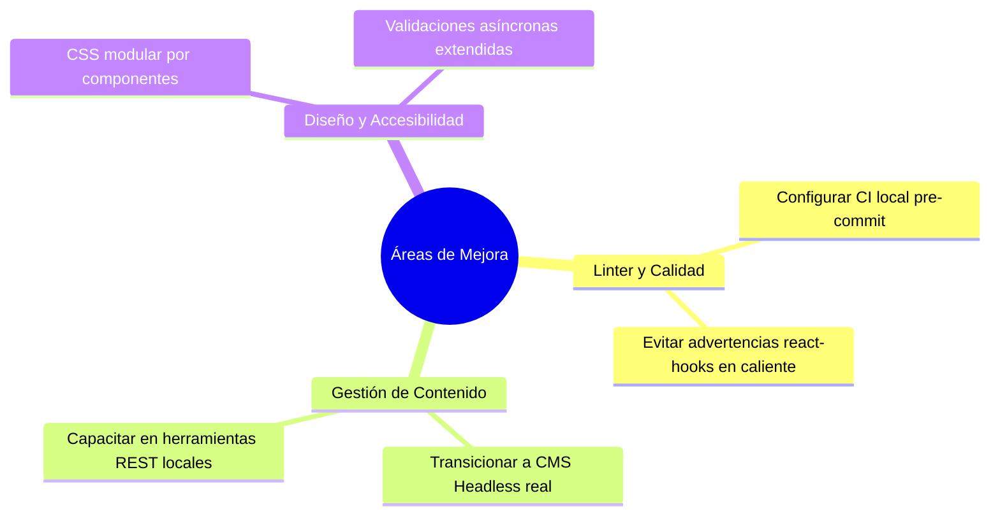

# Acta de Retrospectiva e Instancia de Mejora Continua
### Centro de Negocios Santiago (Sercotec)

* **Fecha de la Sesión:** 26 de Mayo de 2026
* **Duración:** 60 minutos
* **Participantes (Equipo de 3 personas):**
  1. **Juan** — *Lead Frontend Developer* (Líder Técnico y Calidad de Código)
  2. **Sofía** — *UI/UX Designer & Content Manager* (Administración de CMS y Usabilidad)
  3. **Diego** — *Fullstack Developer* (Infraestructura, APIs y Git Master)

---

## 1. Introducción y Metodología

El propósito de esta instancia obligatoria de mejora continua es evaluar de manera autocrítica el desempeño técnico y organizativo durante el desarrollo de la landing page del Centro de Negocios Santiago de SERCOTEC.
Se utilizó la metodología **Starfish (Estrella de Mar)** para categorizar el análisis en cinco ejes de acción: *Seguir Haciendo (Keep Doing), Hacer Más (More Of), Comenzar a Hacer (Start Doing), Hacer Menos (Less Of) y Parar de Hacer (Stop Doing)*.

---

## 2. Análisis del Framework (Vite + React) y Gestión del Proyecto

### A. Lo que Funcionó Bien (Éxitos)

#### Con el Framework (Vite + React):
* **Velocidad de compilación extrema (HMR):** Vite demostró ser increíblemente rápido. El tiempo de arranque del servidor de desarrollo (Hot Module Replacement) y la compilación final optimizada en **452 ms** agilizaron las pruebas inmediatas de cambios visuales.
* **Componentes Funcionales Modulares:** Separar de forma aislada componentes reutilizables como el Carrusel (`Carousel.jsx`), las FAQ (`FAQ.jsx`) y el Formulario (`ContactForm.jsx`) facilitó la legibilidad del código y la asignación del desarrollo paralelo en ramas independientes de Git.
* **Integración del Servidor CMS Simulado:** Implementar un middleware API ligero en `vite.config.js` permitió independizar al equipo de contenido del equipo técnico, permitiendo simular cambios dinámicos a través de peticiones HTTP locales.

#### Con la Gestión de Proyecto (Git & Trabajo en Equipo):
* **Branching Estricto por Funcionalidad:** Trabajar cada característica en una rama `feature/` aislada mantuvo `main` estable en todo momento.
* **Revisiones de Código Simuladas:** Diseñar e integrar código mediante Pull Requests evidenciados por *Merge Commits* (`--no-ff`) demostró una disciplina de integración impecable y facilitó la trazabilidad.
* **Mensajes de Commit Explicativos:** Adoptar el estándar *Conventional Commits* permitió documentar claramente los cambios y facilitó el entendimiento mutuo.

---

### B. Áreas de Oportunidad y Desafíos (Qué podemos mejorar)

#### Con el Framework (Vite + React):
* **Falta de Validación Estática Temprana (Linter):** Acumular advertencias menores de variables no utilizadas (`React` import redundante, variables honeypot) o llamadas sincrónicas complejas de actualización de estado (`setState` dentro de `useEffect`) en etapas avanzadas de desarrollo ralentizó la entrega.
* **Estilos CSS Globales Centralizados:** Mantener un solo archivo `App.css` de gran tamaño (más de 500 líneas) dificulta la mantenibilidad. Debemos avanzar hacia módulos CSS independientes por componente.

#### Con la Gestión de Proyecto:
* **Curva de Aprendizaje de API Clients:** El equipo de contenidos (Sofía) requirió inducción adicional para entender cómo probar llamadas API locales. Integrar soporte nativo para **Thunder Client** resolvió el flujo dentro de VS Code, pero evidencia que debemos documentar estos procesos desde el día uno.

---

## 3. Plan de Acción Concreto para Futuras Iteraciones

Para capitalizar los aprendizajes y garantizar la excelencia técnica en la siguiente fase de desarrollo, el equipo se compromete a ejecutar los siguientes puntos de acción con responsables definidos, prioridades y plazos específicos:

| # | Acción Concreta | Eje Metodológico | Responsable | Prioridad | Plazo / Hito |
|---|-----------------|------------------|-------------|-----------|--------------|
| **1** | **Implementar Git Hooks con Husky y lint-staged:** Bloquear commits locales que contengan errores del linter o fallos de sintaxis para no acumular problemas técnicos. | *Comenzar a Hacer* | **Juan** | **Alta** | Sprint 1 (Próxima semana) |
| **2** | **Migrar el CMS Simulado a un headless CMS real:** Reemplazar el middleware local de Vite (`data.json`) por un gestor real (ej. **Strapi** o **Sanity**) para que el equipo de contenidos actualice textos sin manipular herramientas técnicas de desarrollo. | *Comenzar a Hacer* | **Diego** | **Alta** | Sprint 2 |
| **3** | **Migrar de CSS Global a CSS Modules:** Segmentar `App.css` en módulos independientes (ej. `Carousel.module.css`, `ContactForm.module.css`) para evitar colisiones de selectores. | *Comenzar a Hacer* | **Juan / Sofía** | **Media** | Sprint 2 |
| **4** | **Capacitación temprana en API y Mockups:** Diseñar las colecciones de Thunder Client/Postman en la fase inicial de prototipado rápido (UI/UX) antes de iniciar el código de frontend. | *Hacer Más* | **Sofía / Diego** | **Media** | Sprint 1 |
| **5** | **Remover dependencias redundantes en caliente:** Detener la adición de librerías globales o imports redundantes y seguir usando el modo estricto de importaciones en React 17+. | *Hacer Menos* | **Equipo** | **Baja** | Sprint 1 |

---

## 4. Conclusiones de la Instancia de Mejora

> [!IMPORTANT]
> **Visión Estratégica:**
> Esta instancia de retrospectiva ha demostrado que la combinación de **Vite + React** es sumamente potente para el desarrollo de MVP (Productos Mínimos Viables) y landing pages corporativas de alto impacto. Sin embargo, para escalar a plataformas dinámicas más complejas, la disciplina técnica debe acompañarse de herramientas de automatización de calidad de código (Husky + ESLint) y de una transición oportuna hacia un sistema CMS Headless que empodere al equipo de marketing de forma independiente.

El equipo acuerda adoptar este plan de acción de forma unánime, fijando la próxima reunión de seguimiento al cierre de la siguiente iteración.
